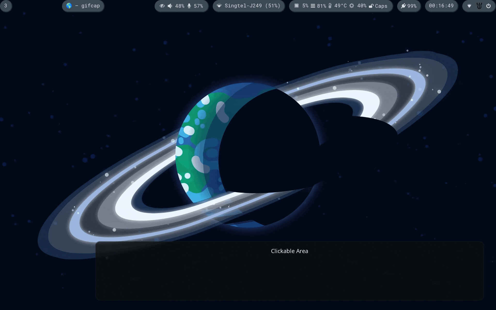

# dotsmenuv2

Dotsmenu is a script that makes use of [rofi](https://github.com/davatorium/rofi) to simplify editing your dotfiles!



It is written to have as little dependencies as possible - almost nothing!
- `rofi` (obviously)
- `sh` (POSIX-compliant)
- `envsubst` (optional)

## How to use
1. Fill up the (`items.ini`)[items.ini] file, adding a section for each files to appear on the menu. An example:
```
[home-manager]
file=$HOME/nix/home/home.nix
posthook=home-manager switch --flake ~/nix/#heyzec --impure |& nom
```
- `file` is the path to the config file, which can include variables.
- `posthook` is the shell command to run upon editor exiting

2. Call the [`dotsmenu.sh`](dotsmenu.sh) script for the menu to appear. It would make sense to set a keybind
that calls this script in an appropriate place, e.g. window manager

